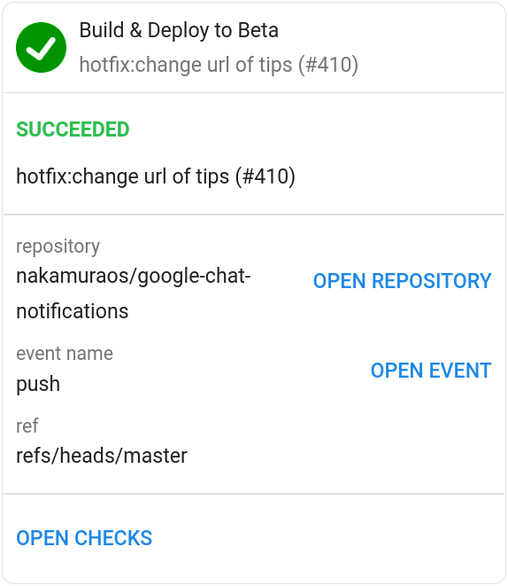
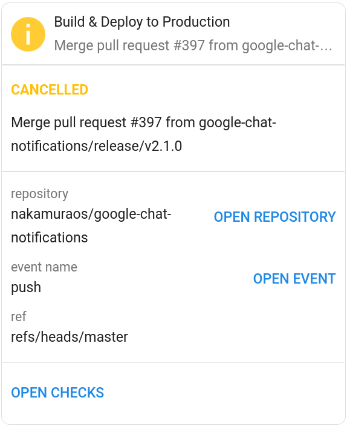
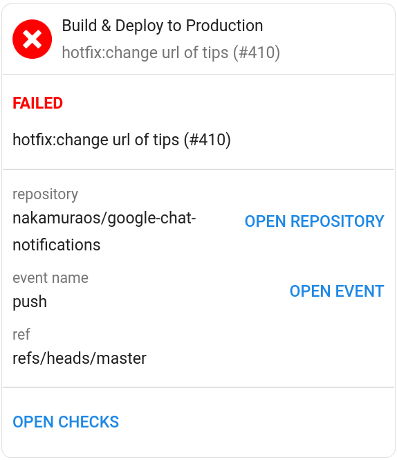

# Google Chat Notification for GitHub Actions


Sends a Google Chat notification.

This repository is generated by [typescript-action](https://github.com/actions/typescript-action).





## Usage
### Parameters
|Name|Required|Description|
|:---:|:---:|:---|
|title|true|Job title. Used for notification titles.|
|subtitle|false|Job subtitle. Used for notification subtitles. We recommend using `${{ github.event.head_commit.message }}`|
|webhookUrl|true|Google Chat Webhook URL.|
|status|true|Job status. Available values are `success`, `failure`, `cancelled`. We recommend using `${{ job.status }}`|
|threadKey|false|Thread key string. Used for send messages to a specific thread in a space|

### Examples
```yaml
- name: Google Chat Notification
  uses: nakamuraos/google-chat-notifications@v2.0.1
  with:
    title: Build
    webhookUrl: ${{ secrets.GOOGLE_CHAT_WEBHOOK }}
    status: ${{ job.status }}
    threadKey: ${{ secrets.GOOGLE_CHAT_THREAD_KEY }}
  if: always()
```
